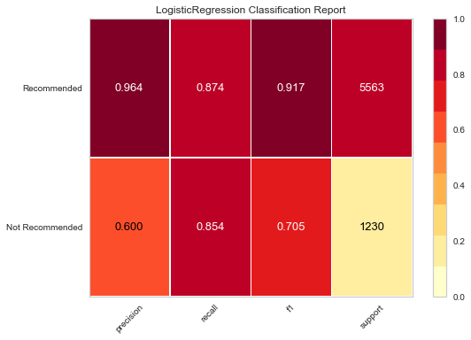

# Sentiment Analysis on Women's Clothing E-Commerce Reviews

## About Sentiment Analysis

Sentiment analysis is detecting whether a text has a positive or negative connotation.
This can help companies understand what is working and what is not based on the customer feedbacks.
Positive reviews show what people like.
Negative reviews identify the issues and can help change directions and improve the product or service.

## Data

This is a Women’s Clothing E-Commerce dataset revolving around the reviews written by customers from Kaggle. This dataset includes 23486 rows and 10 feature variables. Each row corresponds to a customer review and there are 1206 total items that are reviewd by customers.

## Goal of the project
The goal of this project is to use NLP and machine learning models to predict if the purchased clothing items recommended by the customer based on the review they leave on the retailer's website. More specifically predicting the negative comments which are the minority class, will help the sales and marketing team to detect the negative comments across all the platforms, and valuable insight can be extracted from text and help improving the products to meet customer needs and increase the sales.
On the other hand, there is a pre-trained python library called TextBlob that has built-in sentiment analysis functions and this study tries to get better results than that.

## EDA

This plot shows that most of the reviews are positive and the customers are overall happy and recommend the items they have bought. But I am after calssifying the negative comments(minority class) correctly. Therefore not only the accuracy but the recall and F1 score on the negative class has to be high.

Recommended and not recommended items have very close polarity distributions based on TextBlob and most reviews fall in the positive spectrum. So TextBlob doesn’t seem to be a helpful tool to classify the sentiment of this dataset.

## Sentiment Analysis
I decided to try 4 different models for calssification: Logistic Regression, Random Forest, XGBoost and Gaussian Naive Bayes. I also wanted to experiment with different text vectorizers (CountVectorizer, TF-IDF) and text cleaning approaches. The result is 16 models. In order not to bore you with the process, please checkout my notebook. Here are the results of the best model I made that can successfully classify the negative class with recall score of 85 % and F1 Score of 70%. 

