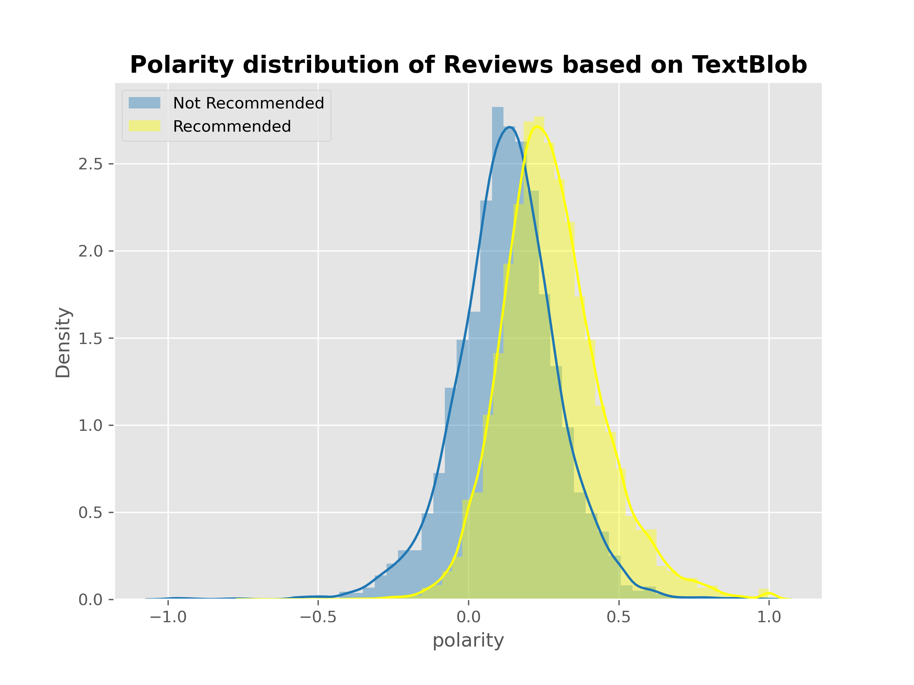
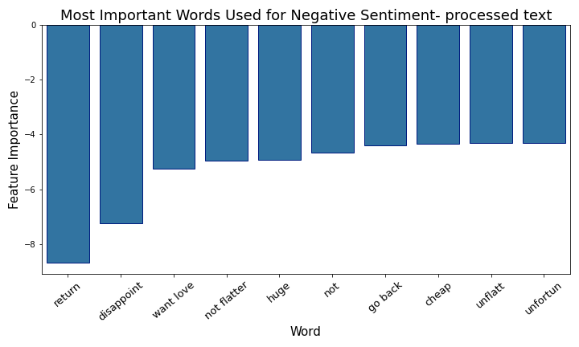

# Sentiment Analysis on Women's Clothing E-Commerce Reviews

## About Sentiment Analysis

Sentiment analysis is detecting whether a text has a positive or negative connotation.
This can help companies understand what is working and what is not based on the customer feedbacks.
Positive reviews show what people like.
Negative reviews identify the issues and can help change directions and improve the product or service.

## Data

This is a Women’s Clothing E-Commerce dataset revolving around the reviews written by customers from Kaggle. This dataset includes 23486 rows and 10 feature variables. Each row corresponds to a customer review and there are 1206 total items that are reviewd by customers.

## Goal of the project
The goal of this project is to use NLP and machine learning models to predict if the purchased clothing items recommended by the customer based on the review they leave on the retailer's website. More specifically predicting the negative comments which are the minority class, will help the sales and marketing team to detect the negative comments across all the platforms, and valuable insight can be extracted from text and help improving the products to meet customer needs and increase the sales.
On the other hand, there is a pre-trained python library called TextBlob that has built-in sentiment analysis functions and this study tries to get better results than that.

## EDA


This plot shows that most of the reviews are positive and the customers are overall happy and recommend the items they have bought. But I am after calssifying the negative comments(minority class) correctly. Therefore not only the accuracy but the recall and F1 score on the negative class has to be high.




Recommended and not recommended items have very close polarity distributions based on TextBlob and most reviews fall in the positive spectrum. So TextBlob doesn’t seem to be a helpful tool to classify the sentiment of this dataset.


## Sentiment Analysis
After deviding the data into train and test sets, I decided to try 4 different models for calssification: Logistic Regression, Random Forest, XGBoost and Gaussian Naive Bayes. I also wanted to experiment with different text vectorizers (CountVectorizer, TF-IDF) and text cleaning approaches. I once made custom stopwords making sure the negative words such as 'No' and 'Not' are not remove from the corpus, along with other NLP methods such as removing punctuation, including N-grams and Stemming and Lemmatization.
The result is 16 models. In order not to bore you with the process, please checkout my notebook. tables below show the differences in the results.


## Best Model

Here are the results of the best model I made that can successfully classify the negative class with recall score of 85 % and F1 Score of 70%. The area under the curve is 0.94 for both classes. 


## Other Findings

Interstingly, I got better results without using NLP and feeding the raw text to the TF-IDF vectorizer!! I also found TF-IDF and CountVectorizer have very simillar results but TF-IDF is just a little bit better with the results.

Plots below show the most important words for positive and negative sentiment classification. The words are very simillar and I didn't need to customize the stop words! I have to highlight that the NLP comes in handy for topic clustering. Specially when including the negative words and n-grams so human beings can interprete the topics and clusters. This is actually another experiment I did with this text data and I will include it on GitHub separately.





## Best model VS. TextBlob

```This dress looked very cute on the website and that is why I ordered it. But I have to return it. It is very boxy.```

This unseen text was examined with TextBlob and got a polarity of 0.45 which is in the positive side, whereas the best model here gives it a 97% probability to be in the negative class. That's the correct answer! 

## Takeaways 
1- Always start with the simplest method!!<br>
2- Noise reduction techniques are not helpful with sentiment analysis of this dataset

## Next Steps
1- Try different text datasets<br>
2- Tune other hyper parameters to see if the F1 score improves or not<br>
3- Try a deep learning model <br>
4- Build an interactive sentiment analyzer which allows user-inputted reviews and give predictions on its sentiment where the users can help the model learn when   it makes a wrong prediction

